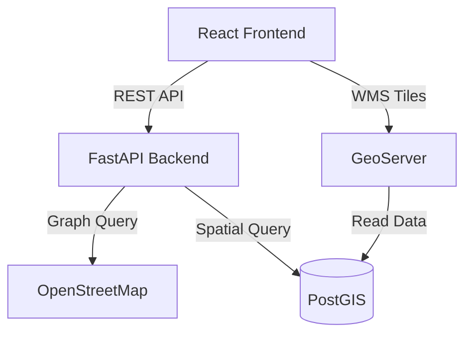

# AccessCity 🏙️♿

**AccessCity** is an inclusive urban planning and navigation platform designed to help people with disabilities (PWDs) move safely around the city. 

Powered by **OpenStreetMap (OSM)** and **Geospatial AI**, AccessCity calculates the safest routes for wheelchair users and visually impaired individuals by avoiding steep slopes, stairs, and dangerous surfaces.


## 🌟 Key Features

- **🛡️ Safe Route Simulation**: Calculates optimal paths based on surface type and incline (OSMnx & NetworkX).
- **🗺️ Interactive Map**: Real-time visualization of safe routes using OpenLayers.
- **👁️ Accessibility Mode (WCAG)**:
  - **High Contrast UI**: For users with low vision.
  - **Text-to-Speech (TTS)**: Auditory route guidance for blind users.
- **🚀 Microservices Architecture**: Scalable Docker-based setup with GeoServer and PostGIS.

## 🛠️ Tech Stack

- **Frontend**: React.js, MapStore / OpenLayers
- **Backend**: Python (FastAPI), OSMnx, NetworkX, Scikit-learn
- **Database**: PostgreSQL (PostGIS)
- **Map Server**: GeoServer
- **Infrastructure**: Docker & Docker Compose

## 🚀 Getting Started

### Prerequisites
- [Docker Desktop](https://www.docker.com/products/docker-desktop) installed and running.

### Installation

1. **Clone the repository**
   ```bash
   git clone https://github.com/yourusername/accesscity.git
   cd accesscity
   ```

2. **Run with Docker Compose**
   This command will build the backend (Python) and frontend (Node.js) images and start the services.
   ```bash
   docker-compose up --build
   ```
   > *Note: The first build may take a few minutes to download the necessary geospatial libraries (GDAL, etc).*

3. **Access the Application**
   - **Frontend**: [http://localhost:8081](http://localhost:8081)
   - **Backend API Docs**: [http://localhost:8000/docs](http://localhost:8000/docs)
   - **GeoServer Dashboard**: [http://localhost:8080/geoserver](http://localhost:8080/geoserver)

## 📖 Usage Guide

1. **Open the Frontend** at `http://localhost:8081`.
2. **Find a Route**:
   - The "Awal" (Start) and "Tujuan" (End) coordinates are pre-filled with a sample route in Yogyakarta (UGM Area).
   - Click **"Cari Rute Aman"**.
   - A green line will appear on the map indicating the accessible path.
3. **Accessibility Options**:
   - Click the **Accessibility Panel** on the left.
   - Toggle **High Contrast** for better visibility.
   - Click **"🔊 Bacakan Rute"** to hear a summary of the trip distance and safety status.

## 🏗️ Architecture



## 🤝 Contributing

Contributions are welcome! Please fork this repository and submit a pull request for any features or bug fixes.

## 📄 License

This project is licensed under the MIT License.
